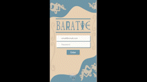

# Recipe App Baratie

<!---Esses são exemplos. Veja https://shields.io para outras pessoas ou para personalizar este conjunto de escudos. Você pode querer incluir dependências, status do projeto e informações de licença aqui--->



> Aplicativo de receitas.

## 💻 Detalhes do Projeto

Projeto desenvolvido durante o curso da Trybe. Este foi o ultimo projeto do modúlo de front-end realizado dia 25/07/22, o projeto foi realizado em grupo o desafio era desenvolver um aplicativo de receitas apenas a versão mobile. Foi escolhido o tema de One Piece por ser algo que todos do grupo gostavam.
Usando de uma API de receitas que varios endpoints de comidas e bebidas. 
A pessoa usuaria poderia acessar a aplicação com email e senha, fazer buscas, filtrar, favoritar, marcar o progresso da lista de ingredientes e compartilhar o link da receita.

### Ajustes e melhorias

O projeto ainda está em desenvolvimento e as próximas atualizações serão voltadas nas seguintes tarefas:

- [ ] Resolver alguns conflitos de rotas
- [ ] Fazer o página responsiva para desktop
- [ ] Melhorar interação do usuário

  🎨 ABERTO PARA SUGESTÕES E MELHORIAS 

## 🚀 Foram utilizadas as seguintes tecnologias:

<p align="left">
<a href="https://developer.mozilla.org/en-US/docs/Web/JavaScript" target="_blank" rel="noreferrer"></a>
<a href="https://developer.mozilla.org/en-US/docs/Glossary/HTML5" target="_blank" rel="noreferrer"></a>
<a href="https://www.w3.org/TR/CSS/#css" target="_blank" rel="noreferrer"></a>
<a href="https://reactjs.org/" target="_blank" rel="noreferrer"></a>
<a href="https://redux.js.org/" target="_blank" rel="noreferrer"></a>
<a href="https://www.figma.com/" target="_blank" rel="noreferrer"></a>
<a href="https://www.adobe.com/uk/products/photoshop.html" target="_blank" rel="noreferrer"></a>
</p>

## ☕ Recipe App Baratie

Foi feito deploy desta aplicação,basta acessar o link abaixo: 

https://baratie-recipesapp.netlify.app

Ou então para utiliza-lá siga as intruções abaixo:

* Requer Node instalado na maquina versão 15+
* Fazer o clone do projeto
* Acessar a pasta do projeto
* Abrir o terminal na pasta do porjeto e instalar as dependências com o comando: 
```
npm install
```
* Após instalação das dependências poderá iniciar o projeto com o comando: 
```
npm start
```

[⬆ Voltar ao topo](#Recipe App Baratie)<br>
